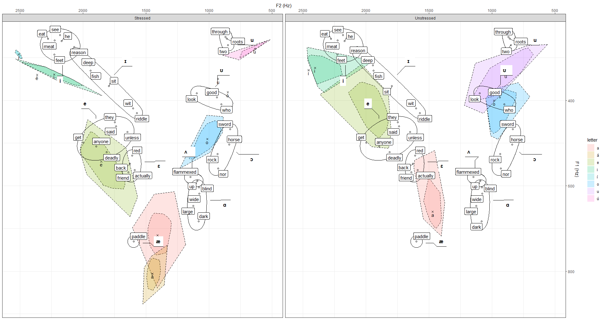
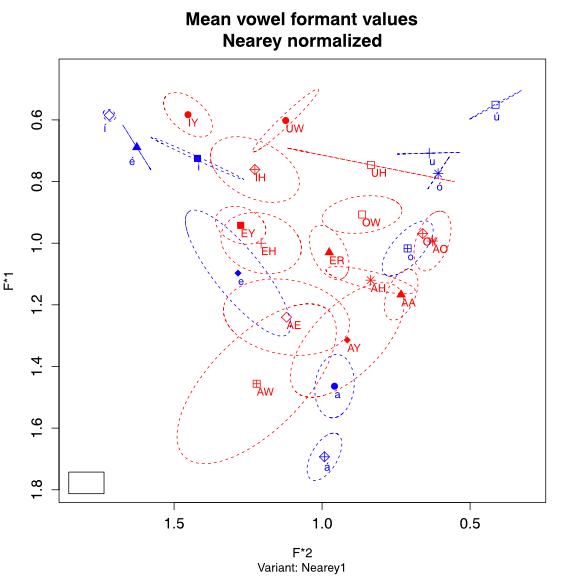

import Aside from '../../../../components/newAside.astro';
import Icon from '../../../../components/svg.astro';

Two recordings of Tolkien's speech were analyzed:

- The [Námarie](https://www.youtube.com/watch?v=mVACqgDqLno) recording to extract Quenya phones;
- The ['Riddles in the Dark'](https://jrrtestate.wpenginepowered.com/wp-content/uploads/2022/01/407reel-a-riddles-in-the-dark.mp3?_=1) recording to extract reference English phones;

*Figure 1: Resulting formants of two recordings.*

*Figure 2: Normalized vowel space of stressed vowels.*